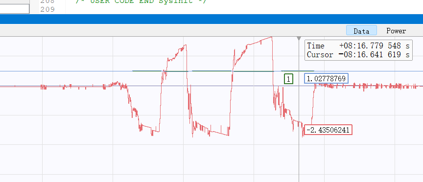
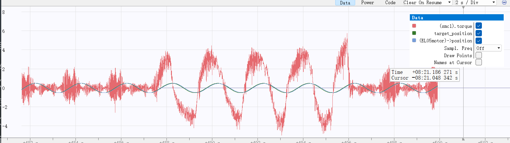

# SMC滑膜控制器
- 此文用以记录笔者初次使用SMC控制器的一些使用经验
## 1. 控制器：
- 物理系统建模为电机输出轴的**动转矩方程**：
$$
    J\dot{\omega}(t) = T_u(t) - T_L(t)
$$
- 建立控制系统为：
$$
\begin{cases} x_1 = \theta_{ref} - \theta \\
x_2 = \omega_{ref} - \omega = \dot{x_1}\end{cases} 
$$
$$
\begin{cases} \dot{x_1} = -\dot{\theta} \\
\dot{x_2} = -\ddot{\theta} \end{cases} 
$$
- 选取的滑模面为**非奇异快速终端滑模面**:
$$
  s = \alpha x_1 + c x_2 + \beta x_2^{\frac{p}{q}}
$$
- 选取控制律为包含积分器的超螺旋滑膜控制律：
$$
\begin{cases} \dot{s} = -k_1sig(s)^{\frac{1}{2}}+\omega \\ 
\dot{\omega} = -k_2sgn(s) \end{cases}
$$
此处$sig(s)$为$|s|^{\frac{1}{2}}sgn(s)$
- 推导得到连续的趋近律为：
$$
\dot{s} = -k_1|s|^{\frac{1}{2}}sgn(s) - k_2 \int_{0}^{t}  sgn(s)dt
$$
- 最终得到的控制律为：
$$
u = \frac{J}{c+\beta\frac{p}{q}x_2^{\frac{p}{q}-1}}(k_1|s|^{\frac{1}{2}}sgn(s)+k_2\int_{0}^{t}sgn(s)dt+\alpha x_2)
$$
- 考虑到实际电机控制中$sgn(s)$会存在震荡，于是引入边界层，使用$sat(k,s)$饱和函数，使用参数k来调节斜率起到调节边界区域大小作用
## 2. 离散化实现
- 由于控制频率为1KHz，使用前向欧拉方法来将连续的控制律近似离散化
- 具体实现见C代码函数`SMC_Calc(SMC_s* smc, float theta, float target_theta, float omiga)`
```c++
float SMC_Calc(SMC_s* smc, float theta, float target_theta, float omiga) {
    float x1 = target_theta - theta;
    float x2 = 0 - filter(smc->last_omiga,omiga,0.1f);

    smc->x1 = x1;
    smc->x2 = x2;

    float s = smc->alpha * x1 + smc->c * x2 + smc->beta * (real_rational_power(x2,smc->p,smc->q));

    smc->s_sum += smc->T*Sat(s, smc->k);
    smc->s_sum = clamp(smc->s_sum, -smc->i_max, smc->i_max);

    float I = smc->k2 * smc->s_sum;

    smc->torque = (smc->J / (smc->c + smc->beta * (smc->p * 1.0f / smc->q) * real_rational_power(x2,smc->p - smc->q,smc->q)))
        * (smc->k1 * sqrtf(fabsf(s)) * Sat(s, smc->k) + I + smc->alpha * x2);

    if (smc->flag) {
        smc->last_torque = smc->torque;
    }
    smc->torque = clamp(smc->torque, -smc->out_max, smc->out_max);
    smc->torque = filter(smc->last_torque,smc->torque, 0.001f);
    smc->last_torque = smc->torque;
    return smc->torque;
}
```
## 3.调参
- 以下的参数理解仅为个人浅薄的经验之谈，如有错误还请指正：
1. 转动惯量$J$: 观察控制律表达式可以得知,$J$可以视作整个控制量的增益，对整个控制量有较大影响。在调参前（第一次给出较小的初始参数时）优先调整$J$，使得系统不再剧烈震动。
2. 滑模面相关参数$\alpha,c,\beta,p,q$:
    1. 前置：控制律可以分成两个部分，包含$sgn(s)$的开关项，和其余项（开关项的称呼可能并不准确，因为在理想模型中，包含sgn函数项在滑模面$s\neq0$的时候会全额输出，$s=0$的时候完全不输出，近似开关控制)。开关项由趋近律引入，作用是迫使系统状态可以达到$s=0$状态，系统在此状态下是完全鲁棒的。因此滑模面$s$本身是调参的重点
   2. 线性部分$\alpha,c$: 这两个参数和状态变量组成滑模面的线性部分，整个超螺旋滑膜可以近似为PI控制，整个滑模面可以近似理解为PID中的误差$error$,指数项在参数过大时极易引起震荡通常$\beta$会给的很小，因此线性项是主要的调参部分。以下为**纯经验**：由于两个参数共同决定s的大小，增大$\alpha$可以提升位置响应，但也会带来震荡，通过调小$c$可以抑制，但是也会降低响应，而且二者的比值也会影响系统表现。
   3. 指数部分$\beta,p,q$: 通常给的很小，但是为了防止开偶次根和奇异问题，有限制条件$\beta,p,q>0$，pq为奇数，而且$1<\frac{p}{q}<2$,笔者一般给$p=7,q=5$。
3. 趋近律增益$k_1,k_2$: 此处可以将两个参数类比为PI控制器的$K_p,K_i$两者对系统的抖动影响小于滑模面参数，但是系统的超调和大幅震荡和二者有关，关系类似于PI控制器。
4. 边界层$k$：该参数决定饱和函数$sat$的斜率，也就决定了边界层的大小，可以尝试利用S函数来替换饱和函数，这样在靠近0的边界区内输出很小，理论上会有更好的效果。
5. 采样周期$T$:是离散化的重要部分，请填写实际控制频率，当然理论上可以降低T（但不改变控制频率）来减少积分累计的速率，但是实际调参发现对系统影响不大。

## 4.效果
- 用于灵足EL05电机空载测试，增加长杆来施加力模拟扰动，效果如下，对扰动的抵抗能力不错

> 红色为控制器输出，蓝线为$\theta$，绿线实际角度为$\theta_{ref}$控制角度


> 此时让发送角度信息为A=1，频率2Hz的正弦波，用手转动长杆阻碍电机运动（根据红色电机输出的反抗力矩可见）红色为控制器输出，蓝线为$\theta$，绿线实际角度为$\theta_{ref}$控制角度


## 附录：哈基米CGH的调参经验
将s显示在波形图上，然后调整一个确认不会导致震荡的初始值，比如：
```"c"
SMC_s smc_pitch={
    .alpha=5.0f,
    .c=2.0f,
    .beta=0.01f,
    .p=7,
    .q=5,
    .k1=1.0f,
    .k2=0.1f,
    .k=0.01f,
    .J=0.01f,
    .i_max=500.0f,
    .out_max=2000.0f,
};
```
然后根据电机给出一个初始的转动惯量增益J=0.1(例子，越大输出力矩越激进)。
此时观测s的情况，如果s没有向0收敛，先增加K1，观测到有收敛趋势后，调整k到1左右的值，然后调整k1，使得其能够收敛到0附近一个具有静差的位置，然后保守地增加k2。调整k1，k2使其能够在s=0处较快地收敛，此时即将系统拉至滑膜面上。如果发现s抗扰动能力不足，调整beta至合适的值。此阶段的K1，K2可以视作Kp，Ki，其作用目的是将s趋近于0  
s能够稳定于0后，调整滑膜面参数alpha，c。其中a在分子位置上，c在分母位置上（不可为0），在增加a前建议先增加c避免震荡。a越大，系统响应理论上越好，c越大，阻尼越大，能减少震荡。二者比值不变的情况下，系统基本可以稳定，而性能可以得到一定程度上的提升。
最后，调整转动惯量增益J，使其缓慢增大到一个不会产生震荡但是又能提高响应的程度，调参即初步完成。


# 复现总结：
未能很好的实现。在4310上，经过调参未能达到较好的效果，考虑到原代码参数使用了高达99百分之的低通滤波，很难想象其是如何实现控制目的的。